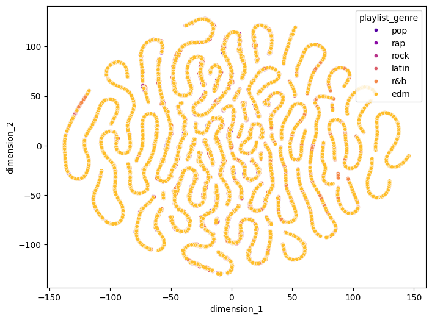

## Exploration


```python
import pandas as pd
df = pd.read_csv('input/spotify_songs.csv')
```


```python
df.head(3)
```


<div>
<style scoped>
    .dataframe tbody tr th:only-of-type {
        vertical-align: middle;
    }

    .dataframe tbody tr th {
        vertical-align: top;
    }

    .dataframe thead th {
        text-align: right;
    }
</style>
<table border="1" class="dataframe">
  <thead>
    <tr style="text-align: right;">
      <th></th>
      <th>track_id</th>
      <th>track_name</th>
      <th>track_artist</th>
      <th>track_popularity</th>
      <th>track_album_id</th>
      <th>track_album_name</th>
      <th>track_album_release_date</th>
      <th>playlist_name</th>
      <th>playlist_id</th>
      <th>playlist_genre</th>
      <th>...</th>
      <th>key</th>
      <th>loudness</th>
      <th>mode</th>
      <th>speechiness</th>
      <th>acousticness</th>
      <th>instrumentalness</th>
      <th>liveness</th>
      <th>valence</th>
      <th>tempo</th>
      <th>duration_ms</th>
    </tr>
  </thead>
  <tbody>
    <tr>
      <th>0</th>
      <td>6f807x0ima9a1j3VPbc7VN</td>
      <td>I Don't Care (with Justin Bieber) - Loud Luxur...</td>
      <td>Ed Sheeran</td>
      <td>66</td>
      <td>2oCs0DGTsRO98Gh5ZSl2Cx</td>
      <td>I Don't Care (with Justin Bieber) [Loud Luxury...</td>
      <td>2019-06-14</td>
      <td>Pop Remix</td>
      <td>37i9dQZF1DXcZDD7cfEKhW</td>
      <td>pop</td>
      <td>...</td>
      <td>6</td>
      <td>-2.634</td>
      <td>1</td>
      <td>0.0583</td>
      <td>0.1020</td>
      <td>0.000000</td>
      <td>0.0653</td>
      <td>0.518</td>
      <td>122.036</td>
      <td>194754</td>
    </tr>
    <tr>
      <th>1</th>
      <td>0r7CVbZTWZgbTCYdfa2P31</td>
      <td>Memories - Dillon Francis Remix</td>
      <td>Maroon 5</td>
      <td>67</td>
      <td>63rPSO264uRjW1X5E6cWv6</td>
      <td>Memories (Dillon Francis Remix)</td>
      <td>2019-12-13</td>
      <td>Pop Remix</td>
      <td>37i9dQZF1DXcZDD7cfEKhW</td>
      <td>pop</td>
      <td>...</td>
      <td>11</td>
      <td>-4.969</td>
      <td>1</td>
      <td>0.0373</td>
      <td>0.0724</td>
      <td>0.004210</td>
      <td>0.3570</td>
      <td>0.693</td>
      <td>99.972</td>
      <td>162600</td>
    </tr>
    <tr>
      <th>2</th>
      <td>1z1Hg7Vb0AhHDiEmnDE79l</td>
      <td>All the Time - Don Diablo Remix</td>
      <td>Zara Larsson</td>
      <td>70</td>
      <td>1HoSmj2eLcsrR0vE9gThr4</td>
      <td>All the Time (Don Diablo Remix)</td>
      <td>2019-07-05</td>
      <td>Pop Remix</td>
      <td>37i9dQZF1DXcZDD7cfEKhW</td>
      <td>pop</td>
      <td>...</td>
      <td>1</td>
      <td>-3.432</td>
      <td>0</td>
      <td>0.0742</td>
      <td>0.0794</td>
      <td>0.000023</td>
      <td>0.1100</td>
      <td>0.613</td>
      <td>124.008</td>
      <td>176616</td>
    </tr>
  </tbody>
</table>
<p>3 rows × 23 columns</p>
</div>


```python
df.shape
```


    (32833, 23)


```python
df.info()
```

    <class 'pandas.core.frame.DataFrame'>
    RangeIndex: 32833 entries, 0 to 32832
    Data columns (total 23 columns):
     #   Column                    Non-Null Count  Dtype  
    ---  ------                    --------------  -----  
     0   track_id                  32833 non-null  object 
     1   track_name                32828 non-null  object 
     2   track_artist              32828 non-null  object 
     3   track_popularity          32833 non-null  int64  
     4   track_album_id            32833 non-null  object 
     5   track_album_name          32828 non-null  object 
     6   track_album_release_date  32833 non-null  object 
     7   playlist_name             32833 non-null  object 
     8   playlist_id               32833 non-null  object 
     9   playlist_genre            32833 non-null  object 
     10  playlist_subgenre         32833 non-null  object 
     11  danceability              32833 non-null  float64
     12  energy                    32833 non-null  float64
     13  key                       32833 non-null  int64  
     14  loudness                  32833 non-null  float64
     15  mode                      32833 non-null  int64  
     16  speechiness               32833 non-null  float64
     17  acousticness              32833 non-null  float64
     18  instrumentalness          32833 non-null  float64
     19  liveness                  32833 non-null  float64
     20  valence                   32833 non-null  float64
     21  tempo                     32833 non-null  float64
     22  duration_ms               32833 non-null  int64  
    dtypes: float64(9), int64(4), object(10)
    memory usage: 5.8+ MB
    


```python
df.select_dtypes(['float', 'int']).describe()
```


<div>
<style scoped>
    .dataframe tbody tr th:only-of-type {
        vertical-align: middle;
    }

    .dataframe tbody tr th {
        vertical-align: top;
    }

    .dataframe thead th {
        text-align: right;
    }
</style>
<table border="1" class="dataframe">
  <thead>
    <tr style="text-align: right;">
      <th></th>
      <th>track_popularity</th>
      <th>danceability</th>
      <th>energy</th>
      <th>key</th>
      <th>loudness</th>
      <th>mode</th>
      <th>speechiness</th>
      <th>acousticness</th>
      <th>instrumentalness</th>
      <th>liveness</th>
      <th>valence</th>
      <th>tempo</th>
      <th>duration_ms</th>
    </tr>
  </thead>
  <tbody>
    <tr>
      <th>count</th>
      <td>32833.000000</td>
      <td>32833.000000</td>
      <td>32833.000000</td>
      <td>32833.000000</td>
      <td>32833.000000</td>
      <td>32833.000000</td>
      <td>32833.000000</td>
      <td>32833.000000</td>
      <td>32833.000000</td>
      <td>32833.000000</td>
      <td>32833.000000</td>
      <td>32833.000000</td>
      <td>32833.000000</td>
    </tr>
    <tr>
      <th>mean</th>
      <td>42.477081</td>
      <td>0.654850</td>
      <td>0.698619</td>
      <td>5.374471</td>
      <td>-6.719499</td>
      <td>0.565711</td>
      <td>0.107068</td>
      <td>0.175334</td>
      <td>0.084747</td>
      <td>0.190176</td>
      <td>0.510561</td>
      <td>120.881132</td>
      <td>225799.811622</td>
    </tr>
    <tr>
      <th>std</th>
      <td>24.984074</td>
      <td>0.145085</td>
      <td>0.180910</td>
      <td>3.611657</td>
      <td>2.988436</td>
      <td>0.495671</td>
      <td>0.101314</td>
      <td>0.219633</td>
      <td>0.224230</td>
      <td>0.154317</td>
      <td>0.233146</td>
      <td>26.903624</td>
      <td>59834.006182</td>
    </tr>
    <tr>
      <th>min</th>
      <td>0.000000</td>
      <td>0.000000</td>
      <td>0.000175</td>
      <td>0.000000</td>
      <td>-46.448000</td>
      <td>0.000000</td>
      <td>0.000000</td>
      <td>0.000000</td>
      <td>0.000000</td>
      <td>0.000000</td>
      <td>0.000000</td>
      <td>0.000000</td>
      <td>4000.000000</td>
    </tr>
    <tr>
      <th>25%</th>
      <td>24.000000</td>
      <td>0.563000</td>
      <td>0.581000</td>
      <td>2.000000</td>
      <td>-8.171000</td>
      <td>0.000000</td>
      <td>0.041000</td>
      <td>0.015100</td>
      <td>0.000000</td>
      <td>0.092700</td>
      <td>0.331000</td>
      <td>99.960000</td>
      <td>187819.000000</td>
    </tr>
    <tr>
      <th>50%</th>
      <td>45.000000</td>
      <td>0.672000</td>
      <td>0.721000</td>
      <td>6.000000</td>
      <td>-6.166000</td>
      <td>1.000000</td>
      <td>0.062500</td>
      <td>0.080400</td>
      <td>0.000016</td>
      <td>0.127000</td>
      <td>0.512000</td>
      <td>121.984000</td>
      <td>216000.000000</td>
    </tr>
    <tr>
      <th>75%</th>
      <td>62.000000</td>
      <td>0.761000</td>
      <td>0.840000</td>
      <td>9.000000</td>
      <td>-4.645000</td>
      <td>1.000000</td>
      <td>0.132000</td>
      <td>0.255000</td>
      <td>0.004830</td>
      <td>0.248000</td>
      <td>0.693000</td>
      <td>133.918000</td>
      <td>253585.000000</td>
    </tr>
    <tr>
      <th>max</th>
      <td>100.000000</td>
      <td>0.983000</td>
      <td>1.000000</td>
      <td>11.000000</td>
      <td>1.275000</td>
      <td>1.000000</td>
      <td>0.918000</td>
      <td>0.994000</td>
      <td>0.994000</td>
      <td>0.996000</td>
      <td>0.991000</td>
      <td>239.440000</td>
      <td>517810.000000</td>
    </tr>
  </tbody>
</table>
</div>


```python
pd.DataFrame({'count': df.shape[0],
              'nulls': df.isnull().sum(),
              'nulls%': df.isnull().mean() * 100,
              'cardinality': df.nunique(),
             })
```


<div>
<style scoped>
    .dataframe tbody tr th:only-of-type {
        vertical-align: middle;
    }

    .dataframe tbody tr th {
        vertical-align: top;
    }

    .dataframe thead th {
        text-align: right;
    }
</style>
<table border="1" class="dataframe">
  <thead>
    <tr style="text-align: right;">
      <th></th>
      <th>count</th>
      <th>nulls</th>
      <th>nulls%</th>
      <th>cardinality</th>
    </tr>
  </thead>
  <tbody>
    <tr>
      <th>track_id</th>
      <td>32833</td>
      <td>0</td>
      <td>0.000000</td>
      <td>28356</td>
    </tr>
    <tr>
      <th>track_name</th>
      <td>32833</td>
      <td>5</td>
      <td>0.015229</td>
      <td>23449</td>
    </tr>
    <tr>
      <th>track_artist</th>
      <td>32833</td>
      <td>5</td>
      <td>0.015229</td>
      <td>10692</td>
    </tr>
    <tr>
      <th>track_popularity</th>
      <td>32833</td>
      <td>0</td>
      <td>0.000000</td>
      <td>101</td>
    </tr>
    <tr>
      <th>track_album_id</th>
      <td>32833</td>
      <td>0</td>
      <td>0.000000</td>
      <td>22545</td>
    </tr>
    <tr>
      <th>track_album_name</th>
      <td>32833</td>
      <td>5</td>
      <td>0.015229</td>
      <td>19743</td>
    </tr>
    <tr>
      <th>track_album_release_date</th>
      <td>32833</td>
      <td>0</td>
      <td>0.000000</td>
      <td>4530</td>
    </tr>
    <tr>
      <th>playlist_name</th>
      <td>32833</td>
      <td>0</td>
      <td>0.000000</td>
      <td>449</td>
    </tr>
    <tr>
      <th>playlist_id</th>
      <td>32833</td>
      <td>0</td>
      <td>0.000000</td>
      <td>471</td>
    </tr>
    <tr>
      <th>playlist_genre</th>
      <td>32833</td>
      <td>0</td>
      <td>0.000000</td>
      <td>6</td>
    </tr>
    <tr>
      <th>playlist_subgenre</th>
      <td>32833</td>
      <td>0</td>
      <td>0.000000</td>
      <td>24</td>
    </tr>
    <tr>
      <th>danceability</th>
      <td>32833</td>
      <td>0</td>
      <td>0.000000</td>
      <td>822</td>
    </tr>
    <tr>
      <th>energy</th>
      <td>32833</td>
      <td>0</td>
      <td>0.000000</td>
      <td>952</td>
    </tr>
    <tr>
      <th>key</th>
      <td>32833</td>
      <td>0</td>
      <td>0.000000</td>
      <td>12</td>
    </tr>
    <tr>
      <th>loudness</th>
      <td>32833</td>
      <td>0</td>
      <td>0.000000</td>
      <td>10222</td>
    </tr>
    <tr>
      <th>mode</th>
      <td>32833</td>
      <td>0</td>
      <td>0.000000</td>
      <td>2</td>
    </tr>
    <tr>
      <th>speechiness</th>
      <td>32833</td>
      <td>0</td>
      <td>0.000000</td>
      <td>1270</td>
    </tr>
    <tr>
      <th>acousticness</th>
      <td>32833</td>
      <td>0</td>
      <td>0.000000</td>
      <td>3731</td>
    </tr>
    <tr>
      <th>instrumentalness</th>
      <td>32833</td>
      <td>0</td>
      <td>0.000000</td>
      <td>4729</td>
    </tr>
    <tr>
      <th>liveness</th>
      <td>32833</td>
      <td>0</td>
      <td>0.000000</td>
      <td>1624</td>
    </tr>
    <tr>
      <th>valence</th>
      <td>32833</td>
      <td>0</td>
      <td>0.000000</td>
      <td>1362</td>
    </tr>
    <tr>
      <th>tempo</th>
      <td>32833</td>
      <td>0</td>
      <td>0.000000</td>
      <td>17684</td>
    </tr>
    <tr>
      <th>duration_ms</th>
      <td>32833</td>
      <td>0</td>
      <td>0.000000</td>
      <td>19785</td>
    </tr>
  </tbody>
</table>
</div>


```python
df[df.isnull().any(axis=1)]
```


<div>
<style scoped>
    .dataframe tbody tr th:only-of-type {
        vertical-align: middle;
    }

    .dataframe tbody tr th {
        vertical-align: top;
    }

    .dataframe thead th {
        text-align: right;
    }
</style>
<table border="1" class="dataframe">
  <thead>
    <tr style="text-align: right;">
      <th></th>
      <th>track_id</th>
      <th>track_name</th>
      <th>track_artist</th>
      <th>track_popularity</th>
      <th>track_album_id</th>
      <th>track_album_name</th>
      <th>track_album_release_date</th>
      <th>playlist_name</th>
      <th>playlist_id</th>
      <th>playlist_genre</th>
      <th>...</th>
      <th>key</th>
      <th>loudness</th>
      <th>mode</th>
      <th>speechiness</th>
      <th>acousticness</th>
      <th>instrumentalness</th>
      <th>liveness</th>
      <th>valence</th>
      <th>tempo</th>
      <th>duration_ms</th>
    </tr>
  </thead>
  <tbody>
    <tr>
      <th>8151</th>
      <td>69gRFGOWY9OMpFJgFol1u0</td>
      <td>NaN</td>
      <td>NaN</td>
      <td>0</td>
      <td>717UG2du6utFe7CdmpuUe3</td>
      <td>NaN</td>
      <td>2012-01-05</td>
      <td>HIP&amp;HOP</td>
      <td>5DyJsJZOpMJh34WvUrQzMV</td>
      <td>rap</td>
      <td>...</td>
      <td>6</td>
      <td>-7.635</td>
      <td>1</td>
      <td>0.1760</td>
      <td>0.0410</td>
      <td>0.00000</td>
      <td>0.1160</td>
      <td>0.649</td>
      <td>95.999</td>
      <td>282707</td>
    </tr>
    <tr>
      <th>9282</th>
      <td>5cjecvX0CmC9gK0Laf5EMQ</td>
      <td>NaN</td>
      <td>NaN</td>
      <td>0</td>
      <td>3luHJEPw434tvNbme3SP8M</td>
      <td>NaN</td>
      <td>2017-12-01</td>
      <td>GANGSTA Rap</td>
      <td>5GA8GDo7RQC3JEanT81B3g</td>
      <td>rap</td>
      <td>...</td>
      <td>11</td>
      <td>-5.364</td>
      <td>0</td>
      <td>0.3190</td>
      <td>0.0534</td>
      <td>0.00000</td>
      <td>0.5530</td>
      <td>0.191</td>
      <td>146.153</td>
      <td>202235</td>
    </tr>
    <tr>
      <th>9283</th>
      <td>5TTzhRSWQS4Yu8xTgAuq6D</td>
      <td>NaN</td>
      <td>NaN</td>
      <td>0</td>
      <td>3luHJEPw434tvNbme3SP8M</td>
      <td>NaN</td>
      <td>2017-12-01</td>
      <td>GANGSTA Rap</td>
      <td>5GA8GDo7RQC3JEanT81B3g</td>
      <td>rap</td>
      <td>...</td>
      <td>10</td>
      <td>-5.907</td>
      <td>0</td>
      <td>0.3070</td>
      <td>0.0963</td>
      <td>0.00000</td>
      <td>0.0888</td>
      <td>0.505</td>
      <td>86.839</td>
      <td>206465</td>
    </tr>
    <tr>
      <th>19568</th>
      <td>3VKFip3OdAvv4OfNTgFWeQ</td>
      <td>NaN</td>
      <td>NaN</td>
      <td>0</td>
      <td>717UG2du6utFe7CdmpuUe3</td>
      <td>NaN</td>
      <td>2012-01-05</td>
      <td>Reggaeton viejito🔥</td>
      <td>0si5tw70PIgPkY1Eva6V8f</td>
      <td>latin</td>
      <td>...</td>
      <td>11</td>
      <td>-6.075</td>
      <td>0</td>
      <td>0.0366</td>
      <td>0.0606</td>
      <td>0.00653</td>
      <td>0.1030</td>
      <td>0.726</td>
      <td>97.017</td>
      <td>252773</td>
    </tr>
    <tr>
      <th>19811</th>
      <td>69gRFGOWY9OMpFJgFol1u0</td>
      <td>NaN</td>
      <td>NaN</td>
      <td>0</td>
      <td>717UG2du6utFe7CdmpuUe3</td>
      <td>NaN</td>
      <td>2012-01-05</td>
      <td>latin hip hop</td>
      <td>3nH8aytdqNeRbcRCg3dw9q</td>
      <td>latin</td>
      <td>...</td>
      <td>6</td>
      <td>-7.635</td>
      <td>1</td>
      <td>0.1760</td>
      <td>0.0410</td>
      <td>0.00000</td>
      <td>0.1160</td>
      <td>0.649</td>
      <td>95.999</td>
      <td>282707</td>
    </tr>
  </tbody>
</table>
<p>5 rows × 23 columns</p>
</div>


```python
df.duplicated().sum()
```


    0


## Cleasing


```python
# Drop nulls
df.dropna(inplace=True)
```


```python
df['track_album_release_date'].dtype
```


    dtype('O')


```python
import re

date_patterns = {
    "YYYY-MM-DD": r'\d{4}-\d{2}-\d{2}$',
    "YYYY-MM":    r'\d{4}-\d{2}$',
    "YYYY":       r'\d{4}$'
}

total = df.shape[0]
print(f"Total records: {total}")

for k,v in date_patterns.items():
    matches = df['track_album_release_date'].astype(str).str.match(v).sum()
    print(f"{k} :{matches}")
    total -= matches

print(f"Else: {total}")
```

    Total records: 32828
    YYYY-MM-DD :30942
    YYYY-MM :31
    YYYY :1855
    Else: 0
    


```python
# Incomplete part will be fill with "-01-01" or "-01"
df['track_album_release_date'] = pd.to_datetime(df['track_album_release_date'], errors='coerce')
```


```python
df['track_album_release_date'].dtype
```


    dtype('<M8[ns]')


```python
for k,v in date_patterns.items():
    matches = df['track_album_release_date'].astype(str).str.match(v).sum()
    print(f"{k} :{matches}")
    total -= matches
```

    YYYY-MM-DD :30942
    YYYY-MM :0
    YYYY :0
    


```python
df['track_album_release_date'].isna().sum()
```


    1886


```python
# Remove commas if data itselft contains it
df = df.applymap(lambda x: str(x).replace(',', ''))
```

    C:\Users\cbs02\AppData\Local\Temp\ipykernel_8048\1593385491.py:2: FutureWarning: DataFrame.applymap has been deprecated. Use DataFrame.map instead.
      df = df.applymap(lambda x: str(x).replace(',', ''))
    


```python
df.to_csv('spotify_songs_cleansed.csv')
```

# dimensionality reduction


```python
from sklearn.manifold import TSNE
import matplotlib.pyplot as plt
import seaborn as sns

# Select dimensions to reduce
selected_columns = ['danceability', 'energy', 'key', 'loudness', 'mode', 'speechiness', 'acousticness', 'instrumentalness', 'liveness', 'valence', 'tempo', 'duration_ms']
selected_data = df[selected_columns]

# Create t-SNE object
tsne = TSNE(n_components=2, random_state=42)

# Compress
compressed_data = tsne.fit_transform(selected_data)

# Make dataframe
result_df = pd.DataFrame(compressed_data, columns=['dimension_1', 'dimension_2'])
merged_df = pd.merge(df, result_df, left_index=True, right_index=True)

# Check the result
print(merged_df.head())

plt.figure(figsize=(8, 6))
sns.scatterplot(x='dimension_1', y='dimension_2', hue='playlist_genre', data=merged_df, palette='plasma', s=20)
plt.show()
```

                     track_id                                         track_name  \
    0  6f807x0ima9a1j3VPbc7VN  I Don't Care (with Justin Bieber) - Loud Luxur...   
    1  0r7CVbZTWZgbTCYdfa2P31                    Memories - Dillon Francis Remix   
    2  1z1Hg7Vb0AhHDiEmnDE79l                    All the Time - Don Diablo Remix   
    3  75FpbthrwQmzHlBJLuGdC7                  Call You Mine - Keanu Silva Remix   
    4  1e8PAfcKUYoKkxPhrHqw4x            Someone You Loved - Future Humans Remix   
    
           track_artist track_popularity          track_album_id  \
    0        Ed Sheeran               66  2oCs0DGTsRO98Gh5ZSl2Cx   
    1          Maroon 5               67  63rPSO264uRjW1X5E6cWv6   
    2      Zara Larsson               70  1HoSmj2eLcsrR0vE9gThr4   
    3  The Chainsmokers               60  1nqYsOef1yKKuGOVchbsk6   
    4     Lewis Capaldi               69  7m7vv9wlQ4i0LFuJiE2zsQ   
    
                                        track_album_name track_album_release_date  \
    0  I Don't Care (with Justin Bieber) [Loud Luxury...      2019-06-14 00:00:00   
    1                    Memories (Dillon Francis Remix)      2019-12-13 00:00:00   
    2                    All the Time (Don Diablo Remix)      2019-07-05 00:00:00   
    3                        Call You Mine - The Remixes      2019-07-19 00:00:00   
    4            Someone You Loved (Future Humans Remix)      2019-03-05 00:00:00   
    
      playlist_name             playlist_id playlist_genre  ... mode speechiness  \
    0     Pop Remix  37i9dQZF1DXcZDD7cfEKhW            pop  ...    1      0.0583   
    1     Pop Remix  37i9dQZF1DXcZDD7cfEKhW            pop  ...    1      0.0373   
    2     Pop Remix  37i9dQZF1DXcZDD7cfEKhW            pop  ...    0      0.0742   
    3     Pop Remix  37i9dQZF1DXcZDD7cfEKhW            pop  ...    1       0.102   
    4     Pop Remix  37i9dQZF1DXcZDD7cfEKhW            pop  ...    1      0.0359   
    
      acousticness instrumentalness liveness valence    tempo duration_ms  \
    0        0.102              0.0   0.0653   0.518  122.036      194754   
    1       0.0724          0.00421    0.357   0.693   99.972      162600   
    2       0.0794         2.33e-05     0.11   0.613  124.008      176616   
    3       0.0287         9.43e-06    0.204   0.277  121.956      169093   
    4       0.0803              0.0   0.0833   0.725  123.976      189052   
    
      dimension_1 dimension_2  
    0  -21.781971  -42.136600  
    1  -85.229332   15.308278  
    2  -78.368042  -88.219765  
    3  -81.768845  -45.588852  
    4  -40.927170   42.893879  
    
    [5 rows x 25 columns]
    


    

    

